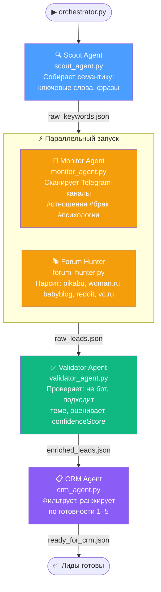

# Схема коммуникации агентов

## Mermaid-диаграмма



## Файлы данных

| Файл | Кто пишет | Кто читает | Что внутри |
|------|-----------|------------|-----------|
| `raw_keywords.json` | Scout | Monitor, Forum Hunter | Ключевые слова, фразы, эмоциональные маркеры |
| `raw_leads.json` | Monitor + Forum Hunter | Validator | Сырые лиды: URL, автор, цитата, интент |
| `enriched_leads.json` | Validator | CRM | Лиды с confidence_score, валидацией |
| `ready_for_crm.json` | CRM | Пользователь / Google Sheets | Финальные лиды с уровнем готовности 1–5 |

## Протокол передачи

- Все данные — JSON-файлы в `./leads_pipeline/`
- Лог каждого агента: `logs/{agent_id}_{timestamp}.log`
- Оркестратор запускает агентов через `asyncio.create_subprocess_exec`
- Ошибка одного агента **не останавливает** весь пайплайн
- Monitor и Forum Hunter пишут в один файл с автомерджем по URL

## Переменные окружения

| Переменная | Агент | Обязательно |
|-----------|-------|-------------|
| `ANTHROPIC_API_KEY` | Scout, Forum Hunter, Validator | Да |
| `TELEGRAM_API_ID` | Monitor | Нет (агент пропускается) |
| `TELEGRAM_API_HASH` | Monitor | Нет (агент пропускается) |
| `GOOGLE_SHEETS_ID` | CRM | Нет (файл всё равно создаётся) |

## Запуск

```bash
# Установить зависимости
pip install anthropic aiohttp beautifulsoup4 telethon gspread

# Запустить пайплайн
cd /root/telegram-bot
python leads_pipeline/orchestrator.py

# Или отдельный агент
python leads_pipeline/agents/scout_agent.py
```
